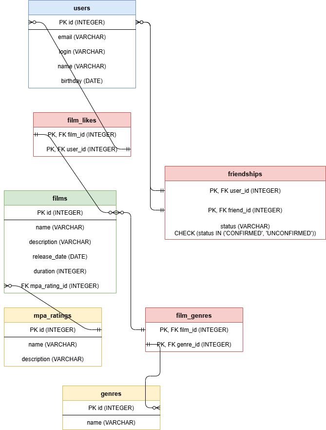

# Filmorate

Сервис для оценки фильмов и подбора рекомендаций.

## Схема базы данных



## Описание таблиц

- **users** — пользователи приложения
- **films** — фильмы с описанием и рейтингом MPA
- **mpa_ratings** — справочник рейтингов MPA (G, PG, PG-13, R, NC-17)
- **genres** — справочник жанров (Комедия, Драма, Мультфильм, Триллер, Документальный, Боевик)
- **film_genres** — связь фильмов и жанров (многие-ко-многим), составной первичный ключ (`film_id`, `genre_id`)
- **film_likes** — лайки пользователей фильмам, составной первичный ключ (`film_id`, `user_id`)
- **friendships** — дружба между пользователями, составной первичный ключ (`user_id`, `friend_id`), статус: `CONFIRMED` / `UNCONFIRMED`

## Примеры SQL-запросов

### Получить все фильмы с рейтингом MPA

```sql
SELECT f.*, m.name AS mpa_rating
FROM films f
JOIN mpa_ratings m ON f.mpa_rating_id = m.id;
```

### Получить фильм с рейтингом MPA и жанрами

```sql
SELECT f.*, m.name AS mpa_rating, g.name AS genre
FROM films f
JOIN mpa_ratings m ON f.mpa_rating_id = m.id
LEFT JOIN film_genres fg ON f.id = fg.film_id
LEFT JOIN genres g ON fg.genre_id = g.id
WHERE f.id = 1;
```

### Получить всех пользователей

```sql
SELECT *
FROM users;
```

### Получить топ-10 популярных фильмов по лайкам

```sql
SELECT f.*, COUNT(fl.user_id) AS likes_count
FROM films f
LEFT JOIN film_likes fl ON f.id = fl.film_id
GROUP BY f.id
ORDER BY likes_count DESC
LIMIT 10;
```

### Поставить лайк фильму

```sql
INSERT INTO film_likes (film_id, user_id)
VALUES (1, 2);
```

### Удалить лайк

```sql
DELETE FROM film_likes
WHERE film_id = 1
  AND user_id = 2;
```

### Добавить в друзья (неподтверждённая дружба)

```sql
INSERT INTO friendships (user_id, friend_id, status)
VALUES (1, 2, 'UNCONFIRMED');
```

### Подтвердить дружбу

```sql
UPDATE friendships
SET status = 'CONFIRMED'
WHERE user_id = 1
  AND friend_id = 2;
```

### Удалить из друзей

```sql
DELETE FROM friendships
WHERE user_id = 1
  AND friend_id = 2;
```

### Получить список друзей пользователя

```sql
SELECT u.*
FROM users u
JOIN friendships fr
ON (
    (fr.user_id = 1 AND u.id = fr.friend_id)
    OR
    (fr.friend_id = 1 AND u.id = fr.user_id)
)
WHERE fr.status = 'CONFIRMED';
```

### Получить общих друзей двух пользователей

```sql
SELECT u.*
FROM users u
JOIN friendships fr1
ON (
    (fr1.user_id = 1 AND u.id = fr1.friend_id)
    OR
    (fr1.friend_id = 1 AND u.id = fr1.user_id)
)
JOIN friendships fr2
ON (
    (fr2.user_id = 2 AND u.id = fr2.friend_id)
    OR
    (fr2.friend_id = 2 AND u.id = fr2.user_id)
)
WHERE fr1.status = 'CONFIRMED'
  AND fr2.status = 'CONFIRMED';
```

### Получить все жанры фильма

```sql
SELECT g.name
FROM genres g
JOIN film_genres fg ON g.id = fg.genre_id
WHERE fg.film_id = 1;
```